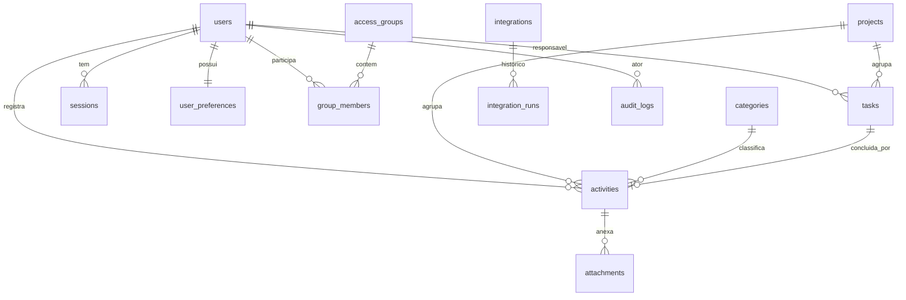

# Banco de dados

PostgreSQL. UUID interno em todas as entidades; chaves públicas legíveis onde o
frontend referencia por texto (users.public_key, categories.slug, projects.slug).
Instantes em timestamptz (UTC). Schema padrão do projeto: diariodev.

## Tabelas (16)
- users: pessoas e nível efetivo. E-mail único (normalizado minúsculo). Soft delete.
- user_preferences: preferências individuais (collapsed, density, tema, projeto padrão).
- sessions: refresh token só como hash, expiração, rotação, revogação.
- categories: nome, slug único, cor, ordem; arquivamento (archived_at) libera o slug.
- projects: nome, slug único; arquivamento; created_by.
- activities: user_id (da sessão), project_id, category_id, category_name_snapshot,
  title, description, occurred_at, duration_minutes, priority, tags, source_task_id,
  client_mutation_id, version, soft delete.
- attachments: activity_id, original_name, storage_key, mime_type, detected_mime_type,
  size_bytes, checksum, uploaded_by, status.
- tasks: título, projeto, responsável, criador, prazo, prioridade, categoria+snapshot,
  done, conclusão (completed_at/by, completion_activity_id), version.
- access_groups: nome, nível, permissions (array), soft delete.
- group_members: (group_id, user_id).
- integrations: nome, tipo, enabled, endpoint, encrypted_secret, events, timeout,
  max_attempts. O segredo nunca é retornado por inteiro.
- integration_runs: histórico de disparos (tentativa, status, http, erro, duração).
- app_settings: configuração global (brand/appearance/fuso).
- audit_logs: ator, ação, entidade, antes/depois, ip_hash, user_agent.
- outbox_events: sequence (cursor monotônico), event_name, aggregate, payload, scope,
  published_at.

## Constraints e índices
Unicidades: users.email, users.public_key, categories.slug, projects.slug,
sessions.refresh_token_hash, tasks.completion_activity_id,
activities (user_id, client_mutation_id), outbox_events.sequence.
Índices em activities (user_id, project_id, category_id, occurred_at, created_at) e
GIN em tags; tasks (assignee_id, project_id, due_date, done); integration_runs
(integration_id, created_at); sessions (user_id, expires_at); audit_logs (ator,
entity_type, entity_id). Ver prisma/schema.prisma.

## Soft delete e histórico
Usuários, atividades, tarefas, grupos e integrações usam deleted_at. Categorias e
projetos arquivam (archived_at). Atividades guardam category_name_snapshot para o
histórico continuar correto após arquivar a categoria.

## Auditoria
audit_logs registra ator, ação e diferenças, sem senha, token, cookie ou segredo.

## Estratégia de migrations
Migrations reais versionadas em prisma/migrations. Em produção, prisma migrate
deploy. Nunca db push em produção. Alterações destrutivas: expandir, migrar, contrair.

## Diagrama (ER simplificado)

