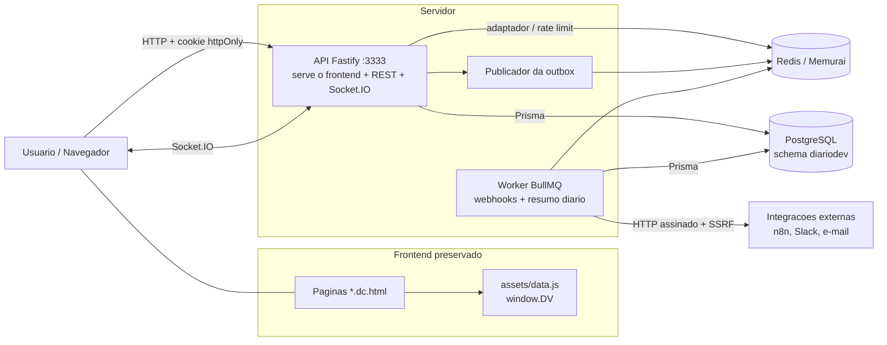
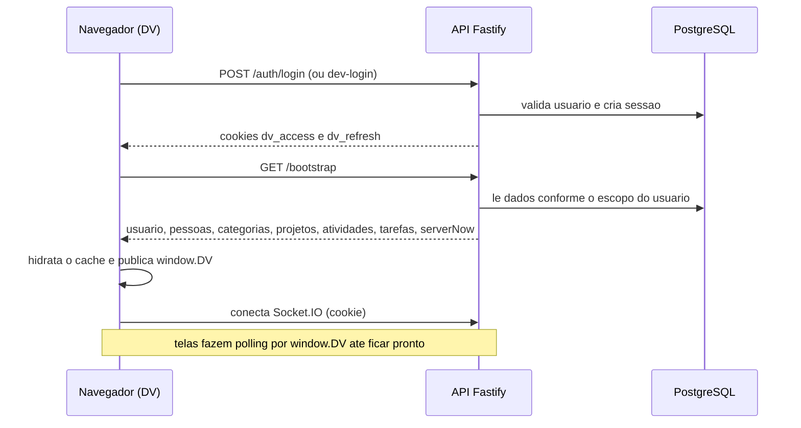
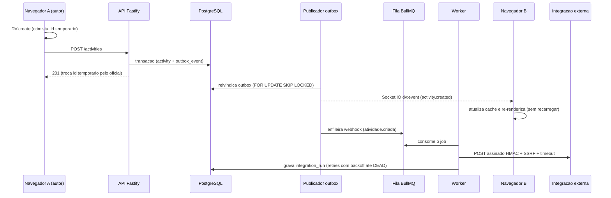
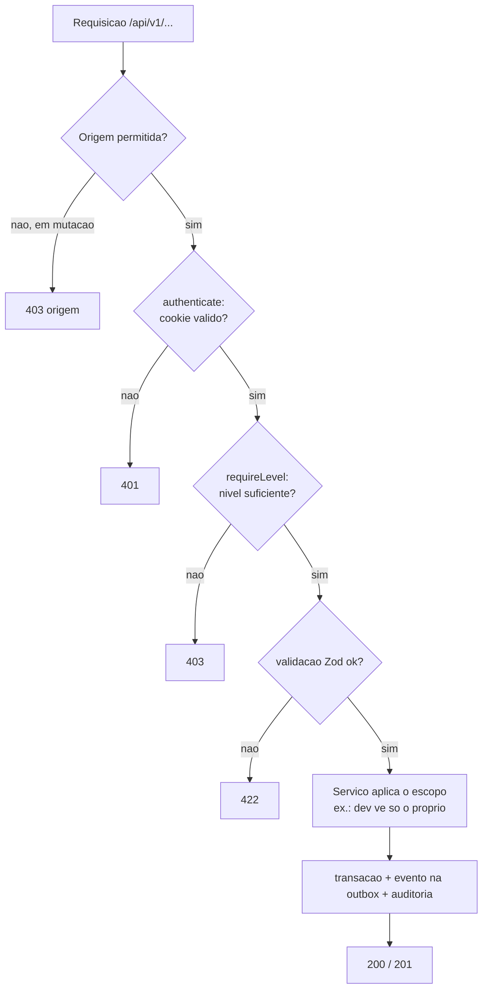
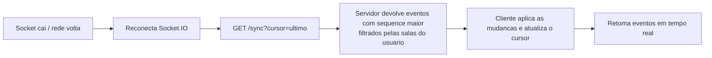

# Fluxograma do sistema

Diagramas em Mermaid. Abrem renderizados no GitHub, no VS Code (extensão Mermaid) ou
em qualquer visualizador compatível.

## 1. Arquitetura geral

## 2. Login e carga inicial

## 3. Criar atividade: escrita otimista, realtime e webhook

## 4. Autorização de uma requisição

## 5. Reconexao e sincronizacao

